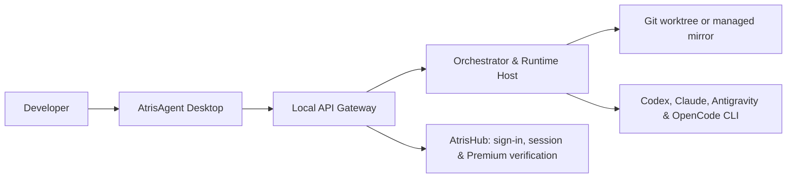

<div align="center">
  
  <h1>AtrisAgent</h1>
  <p><strong>A local-first, mission-driven desktop workspace for supervised AI agents.</strong></p>
  <p>Plan · orchestrate · isolate · review · apply</p>
  <p>
    <a href="README.md"><strong>English</strong></a> ·
    <a href="README.tr.md">Türkçe</a> ·
    <a href="https://agent.atrishub.com">Website</a> ·
    <a href="https://atrishub.com">AtrisHub</a>
  </p>
  <p>
    <a href="LICENSE"></a>
    
    
  </p>
</div>

## What is AtrisAgent?

AtrisAgent is an open-source desktop development workspace that coordinates existing AI coding runtimes such as Codex CLI, Claude Code, Antigravity CLI, and OpenCode on your local machine.

Instead of managing individual terminal sessions manually, you define a goal as a **Mission**. AtrisAgent can break that mission into specialized agent tasks, route each task to an appropriate runtime and model, isolate parallel work, preserve execution state, and let you review changes before applying them to the main project.

AtrisAgent is **not** a model provider. It is a local orchestration layer built on top of the official CLI tools and accounts you already use, adding planning, routing, persistence, isolation, approval boundaries, and human supervision.

> **Developer Preview 0.2.0:** Windows MSI/NSIS packaging and the local runtime sidecar flow are implemented. Installer signing, updater key finalization, clean-machine acceptance testing, and the full production release process are still in progress. Supported AI CLIs must be installed separately and authenticated through their official flows.

## Why AtrisAgent?

| Need | AtrisAgent approach |
| --- | --- |
| Break complex work into manageable steps | Mission plans, dependency graphs, and specialized agent roles |
| Compare parallel implementations safely | Isolated Git worktrees / managed mirrors and Candidate mode |
| Control which model handles each task | Account, runtime, model, reasoning, and trust-mode routing |
| Review before changing the main workspace | Review packs, approval steps, deterministic apply and rollback |
| Keep long-running work stateful | SQLite-backed missions, tasks, events, approvals, and artifacts |
| Reduce terminal noise | Mission/chat-first desktop experience and a Global Inbox |

## How it works



The desktop application communicates with a local gateway bound to loopback. The orchestrator plans and routes work, the runtime host starts the selected official CLI, and the workspace manager isolates Builder execution from the primary working tree.

AtrisHub is used for authentication, session handling, and Premium entitlement verification. It is not used as the execution backend for AI models.

## Highlights

- **Mission-driven workflow** — turn a development goal into a structured, reviewable execution plan.
- **Multi-agent roles** — Orchestrator, Builder, Reviewer, Researcher, and QA responsibilities.
- **Runtime routing** — choose account, runtime, model, reasoning level, and trust mode per route.
- **Dynamic model discovery** — model catalogs are discovered from connected runtimes rather than hard-coded into the application.
- **Workspace isolation** — Git worktrees for repositories and managed mirrors for non-Git projects.
- **Candidate mode** — run two isolated Builder candidates and select the result you want to keep.
- **Approval-first changes** — review, apply, rollback, and approval records remain explicit.
- **Persistent local state** — mission, task, event, approval, and artifact state is stored locally.
- **Global Inbox** — follow active work across workspaces from one place.
- **Developer Mode** — inspect raw runtime console output and event streams when deeper debugging is needed.
- **Tauri desktop stack** — Tauri 2 + React 19 with a local Node.js service layer.

## Supported runtime adapters

| Runtime | Integration | Authentication | Model source |
| --- | --- | --- | --- |
| Codex CLI | App Server model discovery + `codex exec --json` | Official `codex login` | Live App Server `model/list` |
| Claude Code | Headless `--output-format stream-json` | Official `claude auth` | CLI/model-alias capability probe |
| Antigravity CLI | Print/headless structured stream | OS-native keyring and official browser login | Live CLI probe with documented fallback |
| OpenCode | Local HTTP server + SSE | `/provider/auth` and `/auth/:id` | Account-scoped `/config/providers` catalog |

If a model is unavailable or the connected account does not have access to it, that route is not considered runnable.

## Local-first and security boundaries

AtrisAgent is designed so that orchestration and project execution stay on the developer's machine.

- Provider API keys and refresh tokens are not sent to AtrisHub or stored in the AtrisAgent SQLite database.
- Provider credential lifecycle is delegated to the official CLI or the operating-system keyring.
- Remembered AtrisHub sessions use Windows DPAPI or the native OS keyring on supported platforms.
- The local gateway binds to `127.0.0.1`; packaged sidecars also require a short-lived runtime transport token.
- Logs and persisted event layers apply secret redaction.
- Production deployment credentials and server operations are intentionally kept outside this source repository.

Use the private reporting process described in [SECURITY.md](SECURITY.md) for security vulnerabilities. Do not post credentials or sensitive exploit details in public issues.

## Getting started

### Prerequisites

- Node.js 22 LTS
- npm 10+
- Rust stable toolchain
- Git 2.40+
- Tauri 2 platform prerequisites
- On Windows: WebView2 and Microsoft C++ Build Tools
- At least one supported runtime: Codex CLI, Claude Code, Antigravity CLI, or OpenCode

### Install

```bash
git clone https://github.com/merteren97/AtrisAgent.git
cd AtrisAgent
npm ci
```

Optional local configuration can be copied from `.env.example`. Never commit real credentials, private keys, or production secrets.

```bash
cp .env.example .env
```

PowerShell:

```powershell
Copy-Item .env.example .env
```

### Run the desktop development stack

```bash
npm run preflight
npm run tauri:dev
```

`tauri:dev` starts the Vite desktop development server together with the local API gateway and launches the Tauri shell.

To run the web/gateway development stack without the Tauri shell:

```bash
npm run dev:all
```

Example local overrides:

```env
VITE_ATRIS_API_URL=http://127.0.0.1:3001/api
ATRIS_AGENT_DATA_DIR=C:\Users\<user>\AppData\Local\AtrisAgent
```

## Your first mission

1. Open **Accounts** and confirm the installation probe for the CLI you want to use.
2. Create a local account profile with **Add Account**.
3. Complete the runtime's official browser, device-code, or API-key authentication flow.
4. Run **Verify** and **Refresh Models**.
5. Add a workspace. For Git repositories, keep the main branch clean before starting isolated work.
6. Select a Team Template and configure the model route, reasoning level, and trust mode.
7. Start a new Mission from chat and review the generated plan before execution.

## Useful commands

```bash
npm run tauri:dev            # Local gateway + Vite + Tauri desktop
npm run dev:all              # Gateway + Vite without the Tauri shell
npm run typecheck            # TypeScript checks across workspaces
npm test                     # Workspace tests
npm run check                # Typecheck + tests + desktop build
npm run build:landing        # Landing/public-server build
npm run tauri:build:windows  # Windows NSIS/MSI packages
npm run preflight            # Machine, CLI, and toolchain checks
npm run clean                # Remove generated build output
```

## Repository structure

| Path | Responsibility |
| --- | --- |
| `apps/desktop` | React/Vite interface and Tauri native shell |
| `apps/landing` | Public product and download experience |
| `services/api-gateway` | Loopback API, AtrisHub auth proxy, and event transport |
| `services/runtime-host` | CLI adapters and runtime process lifecycle |
| `services/workspace-manager` | Worktree, mirror, checkpoint, and apply workflows |
| `services/public-server` | Landing delivery and verified GitHub release proxy |
| `packages` | Shared domain models, database layer, and contracts |
| `scripts` | Development, preflight, and generated-output utilities |

## Documentation

- [Production-readiness hardening](docs/PRODUCTION_READINESS_HARDENING.md)
- [Public-repository readiness](docs/PUBLIC_REPOSITORY_READINESS.md)
- [Security policy](SECURITY.md)
- [Contributing guide](CONTRIBUTING.md)
- [Changelog](CHANGELOG.md)

## Contributing

Issues and focused pull requests are welcome. Keep changes scoped, preserve the local-first and approval-first boundaries, and include regression coverage when changing runtime execution, authentication, workspace isolation, apply/rollback behavior, or release handling.

For large architectural changes, opening an issue first is recommended so the direction can be discussed before implementation work is duplicated.

## License

AtrisAgent is open-source software licensed under the **Apache License 2.0**. See [`LICENSE`](LICENSE) for the complete license terms.

The Apache License covers the source code and does not grant trademark rights to the AtrisAgent, AtrisHub, or other Atris names, logos, or brand identifiers.
