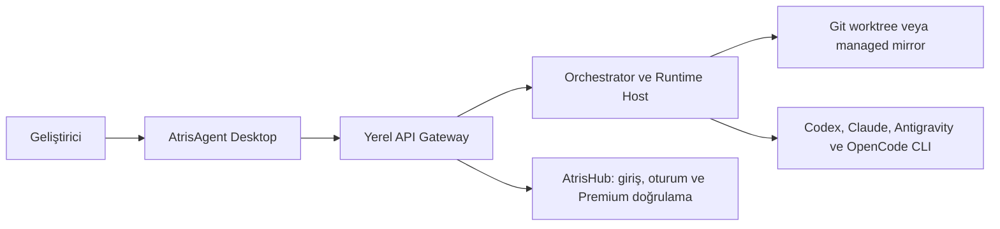

<div align="center">
  
  <h1>AtrisAgent</h1>
  <p><strong>AI CLI'larınızı tek bir local-first, mission-driven geliştirme stüdyosunda yönetin.</strong></p>
  <p>Planlama · paralel ajanlar · izole worktree'ler · inceleme · kontrollü uygulama</p>
  <p>
    <a href="LICENSE"></a>
    
    
  </p>
</div>

## AtrisAgent nedir?

AtrisAgent; Codex CLI, Claude Code, Antigravity CLI ve OpenCode gibi mevcut AI çalışma motorlarını yerel makinenizde koordine eden açık kaynaklı bir masaüstü geliştirme ortamıdır. Terminal oturumlarını tek tek yönetmek yerine bir hedefi **Mission** olarak tanımlar, görevleri uzman ajan rollerine ayırır, çalışmaları izole eder ve sonuçları ana projenize uygulamadan önce incelemenizi sağlar.

AtrisAgent yeni bir model sağlayıcısı değildir. Kullandığınız resmî CLI'ların ve hesapların üzerinde çalışan; planlama, yönlendirme, kalıcılık, güvenlik sınırları ve insan onayı sağlayan yerel orkestrasyon katmanıdır.

> **Developer Preview 0.2.0:** Windows MSI/NSIS paketleme ve yerel runtime sidecar akışı uygulanmıştır. Kurulum paketleri henüz imzalı değildir; updater anahtarı, fiziksel temiz-kurulum kabulü ve üretim release süreci tamamlanmadan son kullanıcı sürümü olarak değerlendirilmemelidir. Desteklenen AI CLI'ları ayrıca kurulmalı ve kendi resmî akışlarıyla yetkilendirilmelidir.

## Neden AtrisAgent?

| İhtiyaç | AtrisAgent yaklaşımı |
|---|---|
| Karmaşık işi parçalara ayırmak | Mission planı, bağımlılık grafiği ve uzman ajan rolleri |
| Paralel sonuçları güvenle karşılaştırmak | İzole Git worktree/managed mirror ve Candidate modu |
| Hangi modelin nerede çalışacağını yönetmek | Account, runtime, model, reasoning ve trust mode yönlendirmesi |
| Değişikliği körlemesine uygulamamak | Review pack, approval ve deterministik apply/rollback akışı |
| Yerel çalışma durumunu korumak | SQLite tabanlı mission, task, event, approval ve artifact kalıcılığı |
| Terminal gürültüsünü azaltmak | Mission/chat-first masaüstü deneyimi ve Global Inbox |

## Nasıl çalışır?



Masaüstü uygulaması yalnızca loopback üzerinde çalışan yerel gateway ile konuşur. Orchestrator görevleri planlar; runtime host seçilen resmî CLI'ı çalıştırır; workspace manager ise her Builder çalışmasını ana çalışma ağacından ayırır. AtrisHub bağlantısı model çalıştırmak için değil, kullanıcı oturumu ve Premium yetkisini doğrulamak için kullanılır.

## Öne çıkan kabiliyetler

- Tauri 2 + React 19 tabanlı Windows masaüstü uygulaması
- Mission ve sohbet merkezli çalışma akışı
- Global Inbox ve workspace bazlı paralel mission görünümü
- Orchestrator, Builder, Reviewer, Researcher ve QA rolleri
- `@Builder`, `@Reviewer`, `/plan`, `/review` ve `/agent` komutları
- Team Template, account route, model, reasoning ve trust mode seçimi
- Çalışma anında keşfedilen model katalogları; uygulamaya gömülü model listesi yoktur
- Git worktree izolasyonu ve Git olmayan projeler için managed mirror
- Candidate modunda iki izole Builder sonucu ve manuel kazanan seçimi
- Review/apply/rollback ve approval kayıtları
- Developer Mode altında ham runtime console ve event akışı

## Desteklenen runtime adapterları

| Runtime | Entegrasyon yolu | Yetkilendirme | Model kaynağı |
|---|---|---|---|
| Codex CLI | App Server model keşfi + `codex exec --json` | Resmî `codex login` | Canlı App Server `model/list` |
| Claude Code | Headless `--output-format stream-json` | Resmî `claude auth` | CLI/model alias capability probe |
| Antigravity CLI | Print/headless structured stream | OS-native keyring ve resmî browser login | Canlı CLI probe ve açıklamalı fallback |
| OpenCode | Local HTTP server + SSE | `/provider/auth` ve `/auth/:id` | Account-scoped `/config/providers` kataloğu |

Bir model bulunamaz veya bağlı hesabın erişim yetkisi yoksa ilgili route otomatik olarak çalıştırılmaz.

## Gizlilik ve AtrisHub sınırı

- AtrisHub yalnızca **giriş, oturum ve Premium entitlement** için yetkili servistir.
- Provider API key'leri ve refresh token'ları AtrisHub'a gönderilmez veya AtrisAgent SQLite veritabanına yazılmaz.
- Provider credential yaşam döngüsü resmî CLI'a ya da işletim sistemi keyring'ine bırakılır.
- Hatırlanan AtrisHub oturumu Windows'ta DPAPI ile, desteklenen diğer ortamlarda işletim sistemi keyring'iyle korunur.
- Yerel gateway `127.0.0.1` üzerinde çalışır; paketlenmiş sidecar ayrıca kısa ömürlü bir runtime transport token'ı ister.
- Log ve persisted event katmanları secret redaction uygular.
- Aktif üretim deployment credential'ları ve sunucu operasyonları bu kaynak deposunun dışında tutulur.

Güvenlik açığı bildirmek için lütfen [Security Policy](SECURITY.md) içindeki özel bildirim sürecini kullanın; hassas değerleri herkese açık issue'lara eklemeyin.

## Hızlı başlangıç

### Gereksinimler

- Node.js 22 LTS ve npm 10+
- Rust stable ve Tauri 2 için gerekli platform araçları
- Git 2.40+
- Windows'ta WebView2 ve Microsoft C++ Build Tools
- Codex CLI, Claude Code, Antigravity CLI veya OpenCode'dan en az biri

### Masaüstü geliştirme

```bash
npm ci
npm run preflight
npm run tauri:dev
```

`tauri:dev`, Vite masaüstü sunucusunu ve yerel API gateway'i otomatik olarak başlatır. Tauri kabuğu olmadan yalnızca web/gateway geliştirme stack'ini çalıştırmak için:

```bash
npm run dev:all
```

İsteğe bağlı yerel yapılandırma:

```env
VITE_ATRIS_API_URL=http://127.0.0.1:3001/api
ATRIS_AGENT_DATA_DIR=C:\Users\<user>\AppData\Local\AtrisAgent
```

Gerçek credential değerlerini `.env` şablonlarına veya kaynak kontrolüne eklemeyin.

## İlk mission

1. **Accounts** ekranında kullanacağınız CLI'ın installation probe sonucunu kontrol edin.
2. `Hesap Ekle` ile yerel account profile oluşturun.
3. İlgili runtime'ın resmî browser, device-code veya API-key akışını tamamlayın.
4. `Verify` ve `Refresh Models` işlemlerini çalıştırın.
5. Workspace ekleyin; Git projesiyse ana branch'in temiz olduğundan emin olun.
6. Team Template, model route, reasoning ve trust mode seçin.
7. Sohbetten yeni bir Mission başlatın ve oluşturulan planı inceleyin.

## Temel komutlar

```bash
npm run tauri:dev            # Yerel gateway + Vite + Tauri masaüstü
npm run dev:all              # Gateway + Vite, Tauri kabuğu olmadan
npm run typecheck            # Tüm workspace TypeScript kontrolleri
npm test                     # Workspace testleri
npm run check                # Typecheck + test + masaüstü build
npm run build:landing        # Landing ve public-server build'i
npm run tauri:build:windows  # Windows NSIS/MSI paketleri
npm run preflight            # Makine, CLI ve toolchain kontrolü
npm run clean                # Üretilmiş build çıktılarının temizliği
```

## Proje yapısı

| Dizin | Sorumluluk |
|---|---|
| `apps/desktop` | React/Vite arayüzü ve Tauri native shell |
| `apps/landing` | Statik ürün ve indirme sayfası |
| `services/api-gateway` | Loopback API, AtrisHub auth proxy ve event transport |
| `services/runtime-host` | CLI adapterları ve süreç yaşam döngüsü |
| `services/workspace-manager` | Worktree, mirror, checkpoint ve apply akışları |
| `services/public-server` | Landing sunumu ve doğrulanmış GitHub release proxy |
| `packages` | Paylaşılan domain, veritabanı ve sözleşmeler |

## Dokümantasyon

- [Production-readiness hardening](docs/PRODUCTION_READINESS_HARDENING.md)
- [Public-repository readiness](docs/PUBLIC_REPOSITORY_READINESS.md)
- [Security policy](SECURITY.md)
- [Contributing guide](CONTRIBUTING.md)
- [Changelog](CHANGELOG.md)

## Lisans

AtrisAgent, [Apache License 2.0](LICENSE) altında lisanslanmıştır.
