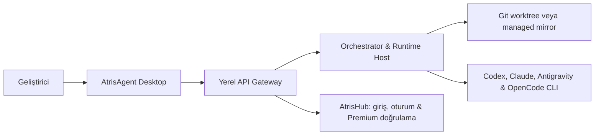

<div align="center">
  
  <h1>AtrisAgent</h1>
  <p><strong>Denetimli AI ajanları için local-first, mission-driven masaüstü çalışma alanı.</strong></p>
  <p>Planla · orkestre et · izole et · incele · uygula</p>
  <p>
    <a href="README.md">English</a> ·
    <a href="README.tr.md"><strong>Türkçe</strong></a> ·
    <a href="https://agent.atrishub.com">Website</a> ·
    <a href="https://atrishub.com">AtrisHub</a>
  </p>
  <p>
    <a href="LICENSE"></a>
    
    
  </p>
</div>

## AtrisAgent nedir?

AtrisAgent; Codex CLI, Claude Code, Antigravity CLI ve OpenCode gibi mevcut AI coding runtime'larını yerel makinenizde koordine eden açık kaynaklı bir masaüstü geliştirme çalışma alanıdır.

Terminal oturumlarını tek tek yönetmek yerine hedefinizi bir **Mission** olarak tanımlarsınız. AtrisAgent bu mission'ı uzman ajan görevlerine bölebilir, her görevi uygun runtime ve modele yönlendirebilir, paralel çalışmaları izole edebilir, yürütme durumunu kalıcı tutabilir ve değişiklikleri ana projenize uygulamadan önce incelemenizi sağlar.

AtrisAgent bir model sağlayıcısı **değildir**. Kullandığınız resmî CLI araçları ve hesapların üzerinde çalışan; planlama, yönlendirme, kalıcılık, izolasyon, onay sınırları ve insan denetimi sağlayan yerel bir orkestrasyon katmanıdır.

> **Developer Preview 0.2.0:** Windows MSI/NSIS paketleme ve local runtime sidecar akışı uygulanmıştır. Installer imzalama, updater anahtarının sonlandırılması, temiz makine kabul testleri ve tam production release süreci halen devam etmektedir. Desteklenen AI CLI'ları ayrıca kurulmalı ve kendi resmî yetkilendirme akışlarıyla doğrulanmalıdır.

## Neden AtrisAgent?

| İhtiyaç | AtrisAgent yaklaşımı |
| --- | --- |
| Karmaşık işi yönetilebilir adımlara bölmek | Mission planları, bağımlılık grafikleri ve uzman ajan rolleri |
| Paralel sonuçları güvenli şekilde karşılaştırmak | İzole Git worktree / managed mirror ve Candidate modu |
| Hangi modelin hangi görevde çalışacağını kontrol etmek | Account, runtime, model, reasoning ve trust-mode yönlendirmesi |
| Ana workspace'i değiştirmeden önce incelemek | Review pack, approval, deterministik apply ve rollback |
| Uzun süren işleri kalıcı tutmak | SQLite tabanlı mission, task, event, approval ve artifact kayıtları |
| Terminal gürültüsünü azaltmak | Mission/chat-first masaüstü deneyimi ve Global Inbox |

## Nasıl çalışır?



Masaüstü uygulaması yalnızca loopback üzerinde çalışan yerel gateway ile konuşur. Orchestrator işi planlar ve yönlendirir, runtime host seçilen resmî CLI'ı başlatır, workspace manager ise Builder çalışmasını ana çalışma ağacından izole eder.

AtrisHub; kullanıcı girişi, oturum yönetimi ve Premium entitlement doğrulaması için kullanılır. AI modellerini çalıştıran execution backend değildir.

## Öne çıkan özellikler

- **Mission-driven çalışma akışı** — geliştirme hedefini yapılandırılmış ve incelenebilir bir yürütme planına dönüştürür.
- **Multi-agent roller** — Orchestrator, Builder, Reviewer, Researcher ve QA sorumlulukları.
- **Runtime yönlendirmesi** — account, runtime, model, reasoning seviyesi ve trust mode seçimi.
- **Dinamik model keşfi** — model listeleri uygulamaya hard-code edilmek yerine bağlı runtime'lardan keşfedilir.
- **Workspace izolasyonu** — Git projeleri için worktree, Git olmayan projeler için managed mirror.
- **Candidate modu** — iki izole Builder sonucu üretip tutulacak sonucu manuel seçme.
- **Approval-first değişiklikler** — review, apply, rollback ve approval kayıtları açık ve izlenebilirdir.
- **Kalıcı yerel durum** — mission, task, event, approval ve artifact verileri yerel olarak saklanır.
- **Global Inbox** — farklı workspace'lerdeki aktif işleri tek yerden takip etme.
- **Developer Mode** — gerektiğinde ham runtime console çıktıları ve event stream'lerini inceleme.
- **Tauri masaüstü stack'i** — Tauri 2 + React 19 ve yerel Node.js servis katmanı.

## Desteklenen runtime adapterları

| Runtime | Entegrasyon | Yetkilendirme | Model kaynağı |
| --- | --- | --- | --- |
| Codex CLI | App Server model keşfi + `codex exec --json` | Resmî `codex login` | Canlı App Server `model/list` |
| Claude Code | Headless `--output-format stream-json` | Resmî `claude auth` | CLI/model alias capability probe |
| Antigravity CLI | Print/headless structured stream | OS-native keyring ve resmî browser login | Canlı CLI probe ve dokümante edilmiş fallback |
| OpenCode | Local HTTP server + SSE | `/provider/auth` ve `/auth/:id` | Account-scoped `/config/providers` kataloğu |

Bir model mevcut değilse veya bağlı hesabın o modele erişimi yoksa ilgili route çalıştırılabilir kabul edilmez.

## Local-first ve güvenlik sınırları

AtrisAgent, orkestrasyon ve proje yürütmesinin geliştiricinin kendi makinesinde kalacağı şekilde tasarlanmıştır.

- Provider API key'leri ve refresh token'ları AtrisHub'a gönderilmez veya AtrisAgent SQLite veritabanına yazılmaz.
- Provider credential yaşam döngüsü resmî CLI'a ya da işletim sistemi keyring'ine bırakılır.
- Hatırlanan AtrisHub oturumları Windows'ta DPAPI, desteklenen diğer sistemlerde native OS keyring ile korunur.
- Yerel gateway `127.0.0.1` üzerinde çalışır; paketlenmiş sidecar ayrıca kısa ömürlü bir runtime transport token'ı ister.
- Log ve persisted event katmanları secret redaction uygular.
- Production deployment credential'ları ve sunucu operasyonları bilinçli olarak bu kaynak deposunun dışında tutulur.

Güvenlik açıkları için [SECURITY.md](SECURITY.md) içindeki özel bildirim sürecini kullanın. Credential veya hassas exploit detaylarını public issue'lara eklemeyin.

## Başlangıç

### Gereksinimler

- Node.js 22 LTS
- npm 10+
- Rust stable toolchain
- Git 2.40+
- Tauri 2 platform gereksinimleri
- Windows'ta WebView2 ve Microsoft C++ Build Tools
- Desteklenen runtime'lardan en az biri: Codex CLI, Claude Code, Antigravity CLI veya OpenCode

### Kurulum

```bash
git clone https://github.com/merteren97/AtrisAgent.git
cd AtrisAgent
npm ci
```

İsteğe bağlı yerel yapılandırma `.env.example` dosyasından oluşturulabilir. Gerçek credential, private key veya production secret değerlerini commit etmeyin.

```bash
cp .env.example .env
```

PowerShell:

```powershell
Copy-Item .env.example .env
```

### Masaüstü geliştirme ortamını çalıştırma

```bash
npm run preflight
npm run tauri:dev
```

`tauri:dev`, Vite masaüstü geliştirme sunucusunu ve yerel API gateway'i başlatır, ardından Tauri kabuğunu açar.

Tauri kabuğu olmadan yalnızca web/gateway geliştirme stack'ini çalıştırmak için:

```bash
npm run dev:all
```

Örnek yerel override değerleri:

```env
VITE_ATRIS_API_URL=http://127.0.0.1:3001/api
ATRIS_AGENT_DATA_DIR=C:\Users\<user>\AppData\Local\AtrisAgent
```

## İlk mission

1. **Accounts** ekranında kullanacağınız CLI için installation probe sonucunu kontrol edin.
2. **Hesap Ekle** ile yerel account profile oluşturun.
3. Runtime'ın resmî browser, device-code veya API-key yetkilendirme akışını tamamlayın.
4. **Verify** ve **Refresh Models** işlemlerini çalıştırın.
5. Workspace ekleyin. Git reposuysa izole çalışmaya başlamadan önce ana branch'i temiz tutun.
6. Team Template seçin; model route, reasoning seviyesi ve trust mode ayarlarını yapılandırın.
7. Chat üzerinden yeni bir Mission başlatın ve yürütmeden önce oluşturulan planı inceleyin.

## Kullanışlı komutlar

```bash
npm run tauri:dev            # Yerel gateway + Vite + Tauri masaüstü
npm run dev:all              # Tauri olmadan gateway + Vite
npm run typecheck            # Workspace TypeScript kontrolleri
npm test                     # Workspace testleri
npm run check                # Typecheck + test + masaüstü build
npm run build:landing        # Landing/public-server build'i
npm run tauri:build:windows  # Windows NSIS/MSI paketleri
npm run preflight            # Makine, CLI ve toolchain kontrolleri
npm run clean                # Üretilmiş build çıktılarını temizler
```

## Repo yapısı

| Dizin | Sorumluluk |
| --- | --- |
| `apps/desktop` | React/Vite arayüzü ve Tauri native shell |
| `apps/landing` | Public ürün ve indirme deneyimi |
| `services/api-gateway` | Loopback API, AtrisHub auth proxy ve event transport |
| `services/runtime-host` | CLI adapterları ve runtime process yaşam döngüsü |
| `services/workspace-manager` | Worktree, mirror, checkpoint ve apply akışları |
| `services/public-server` | Landing sunumu ve doğrulanmış GitHub release proxy |
| `packages` | Paylaşılan domain modelleri, database katmanı ve contract'lar |
| `scripts` | Development, preflight ve generated-output yardımcıları |

## Dokümantasyon

- [Production-readiness hardening](docs/PRODUCTION_READINESS_HARDENING.md)
- [Public-repository readiness](docs/PUBLIC_REPOSITORY_READINESS.md)
- [Security policy](SECURITY.md)
- [Contributing guide](CONTRIBUTING.md)
- [Changelog](CHANGELOG.md)

## Katkıda bulunma

Issue ve odaklı pull request'ler kabul edilir. Değişiklikleri kapsamlı fakat kontrollü tutun; local-first ve approval-first sınırlarını koruyun; runtime execution, authentication, workspace isolation, apply/rollback veya release davranışlarını değiştirirken regression coverage ekleyin.

Büyük mimari değişiklikler için uygulamaya başlamadan önce bir issue açılması, yönün birlikte netleştirilmesi ve aynı işin tekrar edilmemesi açısından önerilir.

## Lisans

AtrisAgent, **Apache License 2.0** altında lisanslanan açık kaynaklı bir yazılımdır. Tam lisans koşulları için [`LICENSE`](LICENSE) dosyasına bakın.

Apache License kaynak kodunu kapsar; AtrisAgent, AtrisHub veya diğer Atris adları, logoları ve marka kimlikleri üzerinde ticari marka hakkı sağlamaz.
